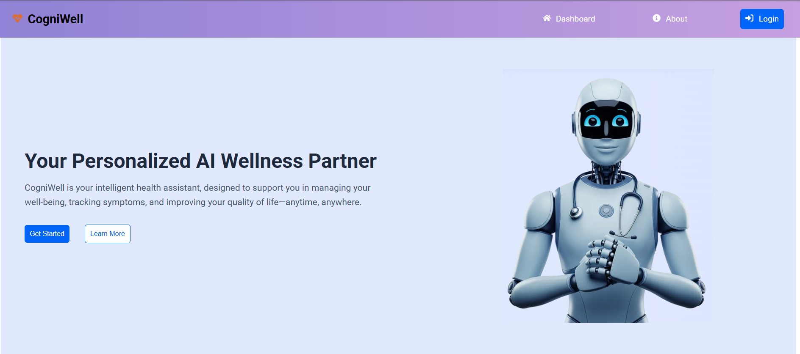

<!DOCTYPE html>
<html lang="en">
<head>
    <meta charset="UTF-8">
    <meta name="viewport" content="width=device-width, initial-scale=1.0">
</head>
<body>
<h2 style="text-decoration: underline; padding-bottom: 4px;">🧠 CogniWell – AI-Powered Health & Wellness Companion</h2>

Welcome to CogniWell, an AI-driven health and wellness platform tailored specifically for users in India. CogniWell leverages Google Gemini AI to provide reliable and insightful health guidance focused on symptom checking and interactive AI chat support. 
With CogniWell, users can easily check symptoms, chat with an intelligent health assistant, and find nearby doctors or clinics — all through a simple, intuitive interface.

<h2 style="text-decoration: underline; padding-bottom: 4px;">🚀 What CogniWell Offers</h2>
<ul>
  <li>🩺 <strong>AI Symptom Checker:</strong> Submit your symptoms and receive AI-generated health insights based on the powerful Gemini API.</li>
  <li>💬 <strong>AI Chat Assistant:</strong> Get detailed advice and personalized health suggestions through a conversational AI assistant.</li>
  <li>🏥 <strong>Doctor & Clinic Finder:</strong> Search for the top 20 clinics and doctors near your location, view them on an interactive map, and contact them directly.</li>
</ul>

<h2 style="text-decoration: underline; padding-bottom: 4px;">📸 Demo & Website</h2>

Visit the live site here: <a href="https://cogniwell.netlify.app/" target="_blank" rel="noopener noreferrer">https://cogniwell.netlify.app/</a>

<h2>Landing Page</h2>

<h2 style="text-decoration: underline; padding-bottom: 4px;">✨ Core Features</h2>
<ul>
  <li>🤖 <strong>Gemini AI Integration:</strong> Uses Google’s Gemini AI to analyze symptoms and engage in meaningful health conversations.</li>
  <li>📍 <strong>Doctor Locator:</strong> Powered by OpenStreetMap for interactive mapping and easy contact.</li>
  <li>🩺 <strong>User-Centric Design:</strong> Clean, accessible UI with secure authentication and personal dashboard features.</li>
  <li>🔐 <strong>Secure Authentication & User Management:</strong>
    <ul>
      <li>JWT-based secure login</li>
      <li>Personal dashboard with saved health plans and chats</li>
    </ul>
  </li>
</ul>

<h2 style="text-decoration: underline; padding-bottom: 4px;">🛠️ Technology Stack</h2>
<table>
  <thead>
    <tr>
      <th>Category</th>
      <th>Technology</th>
    </tr>
  </thead>
  <tbody>
    <tr>
      <td>Frontend</td>
      <td>React.js</td>
    </tr>
    <tr>
      <td>Backend</td>
      <td>Node.js, Express.js, MongoDB</td>
    </tr>
    <tr>
      <td>AI</td>
      <td>Google Gemini API</td>
    </tr>
    <tr>
      <td>Authentication</td>
      <td>JWT Authentication</td>
    </tr>
    <tr>
      <td>Maps</td>
      <td>OpenStreetMap API</td>
    </tr>
    <tr>
      <td>Utilities</td>
      <td>Axios</td>
    </tr>
    <tr>
      <td>Deployment</td>
      <td>Netlify</td>
    </tr>
  </tbody>
</table>

<h2 style="text-decoration: underline; padding-bottom: 4px;">🔄 How It Works</h2>
<ul>
  <li>🩺 <strong>Symptom Checker Flow:</strong>
    <ul>
      <li>Users enter symptoms into a form.</li>
      <li>Input is processed by Google Gemini AI.</li>
      <li>AI returns probable conditions and suggestions.</li>
    </ul>
  </li>
  <li>💬 <strong>AI Chat Flow:</strong>
    <ul>
      <li>Users start a conversation with the AI assistant.</li>
      <li>Gemini AI provides detailed responses and guidance based on user queries.</li>
    </ul>
  </li>
  <li>🗺️ <strong>Find a Doctor Flow:</strong>
    <ul>
      <li>User inputs a location.</li>
      <li>System fetches nearby clinics/doctors using OpenStreetMap data.</li>
      <li>Results are displayed on a map with click-to-call functionality.</li>
    </ul>
  </li>
</ul>

<h2 style="text-decoration: underline; padding-bottom: 4px;">🚧 Features Not Included Yet</h2>
<ul>
  <li>Diet, Exercise, and Meditation plans are currently not implemented.</li>
</ul>

<h2 style="text-decoration: underline; padding-bottom: 4px;">💡 Planned Enhancements</h2>
<ul>
  <li>Tracking user health history for personalized experiences.</li>
  <li>Advanced filtering options for doctors (specializations, ratings).</li>
  <li>Preventive care suggestions powered by AI.</li>
  <li>Push notifications for reminders (e.g., medications, exercises).</li>
</ul>

<h2 style="text-decoration: underline; padding-bottom: 4px;">©️ License & Credits</h2>

© 2025 Ankita Yadav. All rights reserved.

🙌 Made with ❤️ and passion by Ankita Yadav.

</body>
</html>